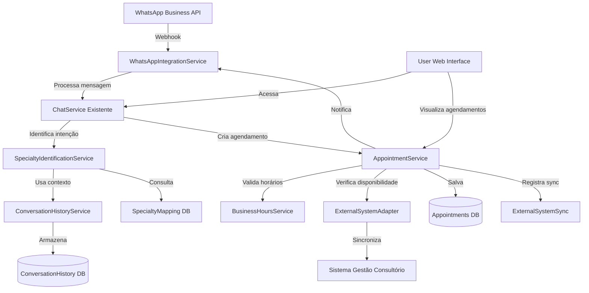

# Chatbot Médico de Atendimento Automático - Arquitetura de Integração

## Introduction

Este documento define a arquitetura de integração para expandir o **Chatbot Puerpério da Sophia** em um sistema completo de atendimento médico automático. O foco principal é na integração com sistemas externos (WhatsApp API, sistemas de gestão do consultório) e na implementação de funcionalidades críticas de agendamento e identificação de especialidade médica.

**Relationship to Existing Architecture:**
Este documento complementa a arquitetura existente do projeto, definindo como novos componentes se integrarão com o sistema atual. O sistema atual utiliza Flask, SQLite, e sistema RAG para busca de conhecimento. As novas funcionalidades serão integradas de forma modular, mantendo compatibilidade com o código existente.

### Existing Project Analysis

#### Current Project State

- **Primary Purpose:** Chatbot especializado em puerpério que fornece informações, orientações e suporte emocional para mulheres no período pós-parto
- **Current Tech Stack:** 
  - Backend: Python 3.8+, Flask
  - Frontend: HTML5, CSS3, JavaScript (ES6+)
  - Database: SQLite (users.db)
  - IA/ML: OpenAI API, Sistema RAG (Retrieval Augmented Generation)
  - Autenticação: Flask-Login, bcrypt
  - Email: Flask-Mail
- **Architecture Style:** Monolito modular com separação backend/frontend
- **Deployment Method:** Render.com com WSGI (Gunicorn), suporte para Railway, Heroku

#### Available Documentation

- README.md com estrutura do projeto
- Documentação de funcionalidades implementadas
- Base de conhecimento em JSON (79 categorias)
- Sistema de alertas médicos implementado
- Guias práticos e cuidados por período

#### Identified Constraints

- SQLite como banco de dados (pode precisar migração para PostgreSQL em produção)
- Sistema atual focado apenas em puerpério
- Integração WhatsApp parcial (precisa expansão)
- Sem sistema de agendamento atual
- Sem integração com sistemas externos de gestão
- Base de conhecimento estática em JSON (pode precisar migração para banco de dados)

### Change Log

| Change | Date | Version | Description | Author |
|--------|------|---------|-------------|--------|
| Initial Architecture | 2025-01-12 | 1.0 | Criação inicial da arquitetura de integração | Architect Agent |

## Enhancement Scope and Integration Strategy

### Enhancement Overview

**Enhancement Type:** Expansão de funcionalidades e integração com sistemas externos
**Scope:** 
- Integração completa com WhatsApp Business API
- Sistema de agendamento de consultas
- Identificação automática de especialidade médica
- Integração com sistemas de gestão do consultório
- Expansão da base de conhecimento para múltiplas especialidades
**Integration Impact:** Alto - Requer novos componentes, APIs externas e mudanças no banco de dados

### Integration Approach

**Code Integration Strategy:** 
- Criar novos módulos em `backend/integrations/` para separar lógica de integração
- Manter compatibilidade com código existente através de interfaces bem definidas
- Usar padrão Adapter para integrações externas
- Implementar camada de serviço para abstrair complexidade das integrações

**Database Integration:**
- Adicionar novas tabelas sem modificar estrutura existente
- Usar migrations para garantir compatibilidade
- Manter dados existentes intactos durante migração

**API Integration:**
- Criar novos endpoints RESTful seguindo padrão existente (`/api/*`)
- Manter endpoints existentes funcionando
- Implementar versionamento de API se necessário

**UI Integration:**
- Expandir interface web existente com novas funcionalidades
- Manter design responsivo e consistente
- Adicionar componentes para agendamento e gestão

### Compatibility Requirements

- **Existing API Compatibility:** Manter todos os endpoints existentes (`/api/chat`, `/api/telefones`, `/api/guias`, etc.)
- **Database Schema Compatibility:** Novas tabelas não devem quebrar queries existentes
- **UI/UX Consistency:** Novas funcionalidades devem seguir padrão visual existente
- **Performance Impact:** Novas integrações não devem degradar performance do sistema atual (< 3s resposta)

## Tech Stack Alignment

### Existing Technology Stack

| Category | Current Technology | Version | Usage in Enhancement | Notes |
|----------|-------------------|---------|---------------------|-------|
| Backend Framework | Flask | Latest | Core framework mantido | Adicionar blueprints para novos módulos |
| Database | SQLite | 3.x | Base mantida, considerar PostgreSQL | Migração opcional para produção |
| Python | Python | 3.8+ | Linguagem principal | Manter compatibilidade |
| Frontend | HTML/CSS/JS | ES6+ | Interface web expandida | Adicionar componentes React/Vue opcional |
| IA/ML | OpenAI API | Latest | Expandir para identificação de especialidade | Adicionar classificação de intenção |
| Authentication | Flask-Login | Latest | Sistema de auth mantido | Expandir para roles (admin, paciente) |
| Email | Flask-Mail | Latest | Notificações de agendamento | Usar para confirmações |

### New Technology Additions

| Technology | Version | Purpose | Rationale | Integration Method |
|------------|---------|---------|-----------|-------------------|
| WhatsApp Business API SDK | Latest | Integração completa WhatsApp | Necessário para comunicação via WhatsApp | Biblioteca Python (twilio ou oficial) |
| Celery | Latest | Processamento assíncrono | Agendamentos e notificações em background | Worker separado |
| Redis | Latest | Cache e message broker | Suporte para Celery e cache de sessões | Serviço externo |
| PostgreSQL | 14+ | Banco de dados produção | Escalabilidade e integridade referencial | Migração opcional |
| SQLAlchemy | Latest | ORM para PostgreSQL | Abstração de banco de dados | Substituir queries SQL diretas gradualmente |
| Pydantic | Latest | Validação de dados | Validação de APIs e modelos | Integração com Flask |
| Requests | Latest | HTTP client | Integração com APIs externas | Biblioteca padrão Python |

## Data Models and Schema Changes

### New Data Models

#### Appointment (Agendamento)

**Purpose:** Armazenar informações de consultas agendadas através do chatbot
**Integration:** Relaciona com User existente, integra com sistema externo de gestão

**Key Attributes:**
- `id`: INTEGER PRIMARY KEY - Identificador único
- `user_id`: INTEGER FOREIGN KEY -> users.id - Relação com usuário
- `specialty`: VARCHAR(100) - Especialidade médica identificada
- `appointment_date`: DATETIME - Data e horário da consulta
- `status`: VARCHAR(20) - Status (pending, confirmed, cancelled, completed)
- `external_appointment_id`: VARCHAR(100) - ID no sistema externo de gestão
- `patient_name`: VARCHAR(200) - Nome da paciente
- `patient_phone`: VARCHAR(20) - Telefone da paciente
- `symptoms`: TEXT - Sintomas relatados que levaram ao agendamento
- `notes`: TEXT - Notas adicionais
- `created_at`: DATETIME - Data de criação
- `updated_at`: DATETIME - Última atualização

**Relationships:**
- **With Existing:** User (many-to-one)
- **With New:** ConversationHistory, ExternalSystemSync

#### ConversationHistory (Histórico de Conversas)

**Purpose:** Armazenar histórico completo de interações para análise e contexto
**Integration:** Complementa sistema de chat existente

**Key Attributes:**
- `id`: INTEGER PRIMARY KEY
- `user_id`: INTEGER FOREIGN KEY -> users.id
- `channel`: VARCHAR(20) - Canal (whatsapp, web)
- `message_type`: VARCHAR(20) - Tipo (user, bot, system)
- `content`: TEXT - Conteúdo da mensagem
- `specialty_identified`: VARCHAR(100) - Especialidade identificada (se aplicável)
- `intent`: VARCHAR(100) - Intenção detectada
- `timestamp`: DATETIME - Data/hora da mensagem
- `metadata`: JSON - Metadados adicionais (sintomas, contexto)

**Relationships:**
- **With Existing:** User (many-to-one)
- **With New:** Appointment (one-to-many)

#### SpecialtyMapping (Mapeamento de Especialidades)

**Purpose:** Mapear sintomas e intenções para especialidades médicas
**Integration:** Base para sistema de identificação de especialidade

**Key Attributes:**
- `id`: INTEGER PRIMARY KEY
- `specialty_name`: VARCHAR(100) - Nome da especialidade
- `keywords`: JSON - Palavras-chave associadas
- `symptoms`: JSON - Sintomas comuns
- `description`: TEXT - Descrição da especialidade
- `is_active`: BOOLEAN - Se está disponível para agendamento
- `created_at`: DATETIME

**Relationships:**
- **With New:** Appointment (one-to-many)

#### ExternalSystemSync (Sincronização com Sistema Externo)

**Purpose:** Rastrear sincronização de dados com sistemas externos
**Integration:** Garantir consistência entre chatbot e sistema de gestão

**Key Attributes:**
- `id`: INTEGER PRIMARY KEY
- `entity_type`: VARCHAR(50) - Tipo (appointment, patient, etc)
- `entity_id`: INTEGER - ID da entidade local
- `external_id`: VARCHAR(100) - ID no sistema externo
- `sync_status`: VARCHAR(20) - Status (pending, synced, failed)
- `last_sync_at`: DATETIME - Última sincronização
- `sync_errors`: TEXT - Erros de sincronização
- `created_at`: DATETIME

**Relationships:**
- **With New:** Appointment (one-to-one)

#### BusinessHours (Horários Comerciais)

**Purpose:** Configurar horários de funcionamento do consultório
**Integration:** Usado para validação de agendamentos e respostas automáticas

**Key Attributes:**
- `id`: INTEGER PRIMARY KEY
- `day_of_week`: INTEGER - Dia da semana (0=segunda, 6=domingo)
- `start_time`: TIME - Hora de início
- `end_time`: TIME - Hora de término
- `is_active`: BOOLEAN - Se está ativo
- `timezone`: VARCHAR(50) - Fuso horário

**Relationships:**
- Nenhuma (tabela de configuração)

### Schema Integration Strategy

**Database Changes Required:**
- **New Tables:** 
  - `appointments` - Agendamentos
  - `conversation_history` - Histórico de conversas
  - `specialty_mapping` - Mapeamento de especialidades
  - `external_system_sync` - Sincronização externa
  - `business_hours` - Horários comerciais
- **Modified Tables:** 
  - `users` - Adicionar campos opcionais (phone, external_patient_id)
- **New Indexes:**
  - `idx_appointments_user_id` - Performance em queries por usuário
  - `idx_appointments_date` - Performance em queries por data
  - `idx_conversation_history_user_timestamp` - Performance em histórico
  - `idx_external_system_sync_status` - Performance em sincronização

**Migration Strategy:**
1. Criar novas tabelas sem modificar existentes
2. Adicionar campos opcionais em `users` (nullable)
3. Migração de dados existentes se necessário
4. Scripts de rollback preparados

**Backward Compatibility:**
- Todas as queries existentes continuam funcionando
- Novos campos são opcionais (nullable)
- Sistema funciona mesmo se novas tabelas estiverem vazias

## Component Architecture

### New Components

#### WhatsAppIntegrationService

**Responsibility:** Gerenciar toda comunicação via WhatsApp Business API
**Integration Points:** 
- Recebe mensagens do WhatsApp via webhook
- Envia respostas através da API
- Integra com ChatService existente

**Key Interfaces:**
- `receive_message(webhook_data)` - Processa mensagem recebida
- `send_message(phone, message, options)` - Envia mensagem
- `send_template_message(phone, template, params)` - Envia template aprovado
- `handle_delivery_status(status_data)` - Processa status de entrega

**Dependencies:**
- **Existing Components:** ChatService (backend/app.py), User model
- **New Components:** AppointmentService, SpecialtyIdentificationService

**Technology Stack:** Python, WhatsApp Business API SDK, Flask webhooks

#### AppointmentService

**Responsibility:** Gerenciar ciclo de vida completo de agendamentos
**Integration Points:**
- Cria agendamentos baseado em conversas
- Valida disponibilidade com sistema externo
- Sincroniza com sistema de gestão

**Key Interfaces:**
- `create_appointment(user_id, specialty, preferred_dates)` - Cria novo agendamento
- `check_availability(specialty, date_range)` - Verifica disponibilidade
- `confirm_appointment(appointment_id)` - Confirma agendamento
- `cancel_appointment(appointment_id, reason)` - Cancela agendamento
- `sync_with_external_system(appointment_id)` - Sincroniza com sistema externo

**Dependencies:**
- **Existing Components:** User model, Database
- **New Components:** ExternalSystemAdapter, BusinessHoursService

**Technology Stack:** Python, SQLAlchemy (opcional), Celery para tarefas assíncronas

#### SpecialtyIdentificationService

**Responsibility:** Identificar especialidade médica baseada em sintomas e contexto
**Integration Points:**
- Analisa mensagens do usuário
- Usa sistema RAG existente expandido
- Integra com OpenAI para classificação

**Key Interfaces:**
- `identify_specialty(user_message, conversation_history)` - Identifica especialidade
- `get_specialty_info(specialty_name)` - Retorna informações sobre especialidade
- `train_model(specialty_data)` - Treina/atualiza modelo (futuro)

**Dependencies:**
- **Existing Components:** RAG system (loader.py), OpenAI integration
- **New Components:** SpecialtyMapping model

**Technology Stack:** Python, OpenAI API, NLTK (já disponível), scikit-learn (opcional)

#### ExternalSystemAdapter

**Responsibility:** Abstrair integração com diferentes sistemas de gestão do consultório
**Integration Points:**
- Interface única para múltiplos sistemas externos
- Implementa padrão Adapter para diferentes APIs

**Key Interfaces:**
- `check_availability(specialty, date_range)` - Verifica disponibilidade
- `create_appointment(appointment_data)` - Cria agendamento no sistema externo
- `update_appointment(appointment_id, updates)` - Atualiza agendamento
- `cancel_appointment(appointment_id)` - Cancela no sistema externo
- `get_patient_info(patient_id)` - Busca informações do paciente

**Dependencies:**
- **Existing Components:** Nenhuma
- **New Components:** AppointmentService, ExternalSystemSync

**Technology Stack:** Python, Requests library, configuração por arquivo YAML/JSON

#### BusinessHoursService

**Responsibility:** Gerenciar horários comerciais e validações
**Integration Points:**
- Valida se mensagem chegou em horário comercial
- Determina resposta apropriada fora do horário
- Usado por AppointmentService para validação

**Key Interfaces:**
- `is_business_hours(timestamp)` - Verifica se está em horário comercial
- `get_business_hours(day_of_week)` - Retorna horários do dia
- `get_next_business_hour()` - Próximo horário comercial
- `configure_hours(config)` - Configura horários

**Dependencies:**
- **Existing Components:** Nenhuma
- **New Components:** BusinessHours model

**Technology Stack:** Python, datetime, pytz para timezones

#### ConversationHistoryService

**Responsibility:** Gerenciar histórico completo de conversas
**Integration Points:**
- Armazena todas as interações
- Fornece contexto para identificação de especialidade
- Usado para análise e melhorias

**Key Interfaces:**
- `save_message(user_id, channel, message_type, content, metadata)` - Salva mensagem
- `get_conversation_history(user_id, limit)` - Retorna histórico
- `get_context_for_specialty(user_id)` - Extrai contexto relevante

**Dependencies:**
- **Existing Components:** User model
- **New Components:** ConversationHistory model

**Technology Stack:** Python, SQLite/PostgreSQL

### Component Interaction Diagram



## API Design and Integration

### API Integration Strategy

**API Integration Strategy:** 
- Expandir API REST existente com novos endpoints
- Manter padrão `/api/*` já estabelecido
- Implementar autenticação via JWT ou sessão (Flask-Login)
- Versionamento através de prefixo `/api/v1/` se necessário

**Authentication:** 
- Manter Flask-Login existente
- Adicionar autenticação por token para integrações externas
- Roles: admin, patient, system

**Versioning:** 
- Versão atual: v1 (implícita)
- Preparar para v2 se necessário no futuro

### New API Endpoints

#### POST /api/whatsapp/webhook

- **Method:** POST
- **Endpoint:** `/api/whatsapp/webhook`
- **Purpose:** Receber webhooks do WhatsApp Business API
- **Integration:** Integra com WhatsAppIntegrationService

**Request:**
```json
{
  "object": "whatsapp_business_account",
  "entry": [{
    "id": "WHATSAPP_BUSINESS_ACCOUNT_ID",
    "changes": [{
      "value": {
        "messaging_product": "whatsapp",
        "metadata": {
          "display_phone_number": "PHONE_NUMBER",
          "phone_number_id": "PHONE_NUMBER_ID"
        },
        "contacts": [{
          "profile": {
            "name": "USER_NAME"
          },
          "wa_id": "USER_PHONE"
        }],
        "messages": [{
          "from": "USER_PHONE",
          "id": "MESSAGE_ID",
          "timestamp": "TIMESTAMP",
          "text": {
            "body": "MESSAGE_TEXT"
          },
          "type": "text"
        }]
      }
    }]
  }]
}
```

**Response:**
```json
{
  "status": "success",
  "message_id": "MESSAGE_ID"
}
```

#### POST /api/appointments

- **Method:** POST
- **Endpoint:** `/api/appointments`
- **Purpose:** Criar novo agendamento
- **Integration:** Usa AppointmentService

**Request:**
```json
{
  "user_id": 123,
  "specialty": "Ginecologia",
  "preferred_dates": [
    "2025-01-15T10:00:00",
    "2025-01-16T14:00:00"
  ],
  "symptoms": "Dor abdominal e náusea",
  "patient_name": "Maria Silva",
  "patient_phone": "+5511999999999"
}
```

**Response:**
```json
{
  "appointment_id": 456,
  "status": "pending",
  "appointment_date": "2025-01-15T10:00:00",
  "specialty": "Ginecologia",
  "confirmation_required": true
}
```

#### GET /api/appointments/availability

- **Method:** GET
- **Endpoint:** `/api/appointments/availability?specialty=Ginecologia&start_date=2025-01-15&end_date=2025-01-20`
- **Purpose:** Verificar disponibilidade de horários
- **Integration:** Integra com ExternalSystemAdapter

**Response:**
```json
{
  "available_slots": [
    {
      "date": "2025-01-15",
      "times": ["10:00", "11:00", "14:00", "15:00"]
    },
    {
      "date": "2025-01-16",
      "times": ["09:00", "10:00", "14:00"]
    }
  ]
}
```

#### POST /api/specialty/identify

- **Method:** POST
- **Endpoint:** `/api/specialty/identify`
- **Purpose:** Identificar especialidade médica baseada em sintomas
- **Integration:** Usa SpecialtyIdentificationService

**Request:**
```json
{
  "message": "Estou com dor de cabeça forte e visão embaçada há 3 dias",
  "conversation_history": [
    {"role": "user", "content": "Olá"},
    {"role": "assistant", "content": "Olá! Como posso ajudar?"}
  ]
}
```

**Response:**
```json
{
  "specialty": "Neurologia",
  "confidence": 0.85,
  "reasoning": "Dor de cabeça forte combinada com visão embaçada sugere necessidade de avaliação neurológica",
  "alternative_specialties": [
    {"name": "Oftalmologia", "confidence": 0.65},
    {"name": "Clínica Geral", "confidence": 0.45}
  ]
}
```

#### GET /api/specialties

- **Method:** GET
- **Endpoint:** `/api/specialties`
- **Purpose:** Listar especialidades disponíveis
- **Integration:** Consulta SpecialtyMapping

**Response:**
```json
{
  "specialties": [
    {
      "name": "Ginecologia",
      "description": "Cuidados com saúde da mulher",
      "is_available": true,
      "common_symptoms": ["dor pélvica", "irregularidade menstrual"]
    },
    {
      "name": "Pediatria",
      "description": "Cuidados com saúde infantil",
      "is_available": true,
      "common_symptoms": ["febre em criança", "dificuldade respiratória"]
    }
  ]
}
```

## External API Integration

### WhatsApp Business API

- **Purpose:** Comunicação principal com pacientes via WhatsApp
- **Documentation:** https://developers.facebook.com/docs/whatsapp
- **Base URL:** `https://graph.facebook.com/v18.0/`
- **Authentication:** Bearer Token (Access Token)
- **Integration Method:** Webhooks para receber mensagens, REST API para enviar

**Key Endpoints Used:**
- `POST /{phone-number-id}/messages` - Enviar mensagens
- `GET /{phone-number-id}` - Verificar status
- Webhook para receber mensagens (configurado no Meta Business)

**Error Handling:** 
- Retry automático com backoff exponencial
- Log de erros para análise
- Fallback para notificação por email se WhatsApp falhar

### Sistema de Gestão do Consultório (Genérico)

- **Purpose:** Sincronização de agendamentos e dados de pacientes
- **Documentation:** Varia conforme sistema (TOTVS, MV, etc.)
- **Base URL:** Configurável por arquivo de configuração
- **Authentication:** OAuth2, API Key, ou Basic Auth (configurável)
- **Integration Method:** REST API com adapter pattern

**Key Endpoints Used:**
- `GET /api/availability` - Verificar disponibilidade
- `POST /api/appointments` - Criar agendamento
- `PUT /api/appointments/{id}` - Atualizar agendamento
- `DELETE /api/appointments/{id}` - Cancelar agendamento
- `GET /api/patients/{id}` - Buscar dados do paciente

**Error Handling:**
- Tratamento específico por tipo de sistema
- Sincronização assíncrona com retry
- Fila de sincronização para garantir consistência

## Source Tree Integration

### Existing Project Structure

```
chatbot-puerperio/
├── backend/
│   ├── app.py                 # Aplicação Flask principal
│   ├── loader.py              # Carregador de base de conhecimento
│   ├── templates/             # Templates HTML
│   ├── static/                # CSS, JS, imagens
│   └── *.json                 # Bases de conhecimento
├── docs/                      # Documentação
└── requirements.txt           # Dependências
```

### New File Organization

```
chatbot-puerperio/
├── backend/
│   ├── app.py                 # Aplicação Flask principal (expandido)
│   ├── loader.py              # Carregador de base de conhecimento (existente)
│   ├── templates/             # Templates HTML (existente)
│   ├── static/                 # CSS, JS, imagens (existente)
│   ├── integrations/          # NOVO: Módulo de integrações
│   │   ├── __init__.py
│   │   ├── whatsapp/         # Integração WhatsApp
│   │   │   ├── __init__.py
│   │   │   ├── service.py    # WhatsAppIntegrationService
│   │   │   ├── webhook.py    # Handlers de webhook
│   │   │   └── templates.py  # Templates de mensagens
│   │   ├── external_systems/ # Integração sistemas externos
│   │   │   ├── __init__.py
│   │   │   ├── adapter.py    # ExternalSystemAdapter (base)
│   │   │   ├── totvs.py      # Implementação TOTVS
│   │   │   ├── mv.py         # Implementação MV
│   │   │   └── generic.py    # Implementação genérica
│   │   └── config.py         # Configuração de integrações
│   ├── services/              # NOVO: Serviços de negócio
│   │   ├── __init__.py
│   │   ├── appointment_service.py
│   │   ├── specialty_service.py
│   │   ├── business_hours_service.py
│   │   └── conversation_history_service.py
│   ├── models/                # NOVO: Modelos de dados
│   │   ├── __init__.py
│   │   ├── appointment.py
│   │   ├── conversation_history.py
│   │   ├── specialty_mapping.py
│   │   ├── external_sync.py
│   │   └── business_hours.py
│   ├── database/              # NOVO: Migrações e schema
│   │   ├── __init__.py
│   │   ├── migrations/        # Scripts de migração
│   │   └── schema.py         # Definição de schema
│   ├── tasks/                 # NOVO: Tarefas assíncronas (Celery)
│   │   ├── __init__.py
│   │   ├── sync_tasks.py     # Sincronização com sistemas externos
│   │   └── notification_tasks.py  # Notificações
│   └── *.json                 # Bases de conhecimento (existente)
├── docs/
│   └── architecture/          # NOVO: Documentação de arquitetura
│       ├── integration.md
│       └── api-reference.md
└── requirements.txt           # Dependências (atualizado)
```

### Integration Guidelines

- **File Naming:** snake_case para Python, seguir padrão existente
- **Folder Organization:** Separar por responsabilidade (integrations, services, models)
- **Import/Export Patterns:** Usar imports absolutos, evitar imports circulares

## Infrastructure and Deployment Integration

### Existing Infrastructure

**Current Deployment:** Render.com com WSGI (Gunicorn)
**Infrastructure Tools:** GitHub para CI/CD, Render para deploy automático
**Environments:** Produção (Render), desenvolvimento local

### Enhancement Deployment Strategy

**Deployment Approach:** 
- Deploy incremental sem interrupção do serviço
- Novos componentes são adicionados gradualmente
- Feature flags para ativar/desativar funcionalidades

**Infrastructure Changes:**
- Adicionar worker Celery para tarefas assíncronas (Render Worker)
- Adicionar Redis para cache e message broker (Render Redis)
- Considerar PostgreSQL para produção (Render PostgreSQL)
- Configurar webhook do WhatsApp no Meta Business

**Pipeline Integration:**
- Manter pipeline existente no Render
- Adicionar testes de integração antes do deploy
- Deploy automático após merge na branch main

### Rollback Strategy

**Rollback Method:** 
- Versões anteriores mantidas no Render
- Rollback rápido através do dashboard
- Database migrations reversíveis

**Risk Mitigation:**
- Feature flags para desabilitar funcionalidades problemáticas
- Monitoramento de erros e performance
- Testes em ambiente de staging antes de produção

**Monitoring:**
- Logs centralizados no Render
- Alertas para erros críticos
- Métricas de performance (tempo de resposta, taxa de erro)

## Coding Standards and Conventions

### Existing Standards Compliance

**Code Style:** PEP 8 (Python), seguir convenções Flask
**Linting Rules:** flake8 ou black (se configurado)
**Testing Patterns:** pytest (se existir), unittest como fallback
**Documentation Style:** Docstrings em português, comentários quando necessário

### Enhancement-Specific Standards

- **Integration Code:** Sempre usar try/except com logging detalhado
- **API Responses:** Sempre retornar JSON com status code apropriado
- **Database Queries:** Usar prepared statements, evitar SQL injection
- **Async Tasks:** Sempre definir retry e timeout para tarefas Celery
- **Error Handling:** Sempre logar erros antes de retornar ao usuário

### Critical Integration Rules

- **Existing API Compatibility:** Nunca quebrar endpoints existentes, usar versionamento se necessário
- **Database Integration:** Sempre usar migrations, nunca modificar schema diretamente
- **Error Handling:** Manter padrão de resposta de erro existente
- **Logging Consistency:** Usar mesmo formato de log do sistema existente

## Testing Strategy

### Integration with Existing Tests

**Existing Test Framework:** Não identificado (adicionar pytest)
**Test Organization:** Criar estrutura `tests/` na raiz
**Coverage Requirements:** Mínimo 70% para novos componentes

### New Testing Requirements

#### Unit Tests for New Components

- **Framework:** pytest
- **Location:** `tests/unit/`
- **Coverage Target:** 80% para serviços críticos
- **Integration with Existing:** Executar junto com testes existentes (se houver)

#### Integration Tests

- **Scope:** 
  - Testar integração WhatsApp end-to-end (mock da API)
  - Testar fluxo completo de agendamento
  - Testar sincronização com sistema externo (mock)
- **Existing System Verification:** Garantir que funcionalidades existentes não quebraram
- **New Feature Testing:** Testar todos os novos endpoints e serviços

#### Regression Testing

- **Existing Feature Verification:** Testar chat existente, autenticação, base de conhecimento
- **Automated Regression Suite:** Criar suite de testes de regressão
- **Manual Testing Requirements:** Testar fluxo completo de agendamento manualmente antes de produção

## Security Integration

### Existing Security Measures

**Authentication:** Flask-Login com bcrypt para senhas
**Authorization:** Básico (usuário logado ou não)
**Data Protection:** Senhas hasheadas, dados em SQLite
**Security Tools:** Nenhum específico identificado

### Enhancement Security Requirements

**New Security Measures:**
- HTTPS obrigatório para webhooks do WhatsApp
- Validação de assinatura de webhook (verificar origem)
- Rate limiting para APIs públicas
- Sanitização de inputs de usuário
- Criptografia de dados sensíveis (LGPD)
- Autenticação por token para APIs externas

**Integration Points:**
- Webhook do WhatsApp deve validar assinatura
- APIs externas devem usar autenticação segura
- Dados de pacientes devem ser criptografados em repouso

**Compliance Requirements:**
- LGPD (Lei Geral de Proteção de Dados)
- Logs de acesso a dados sensíveis
- Consentimento explícito para uso de dados

### Security Testing

**Existing Security Tests:** Não identificados (adicionar)
**New Security Test Requirements:**
- Testes de autenticação e autorização
- Testes de validação de input
- Testes de rate limiting
- Testes de criptografia

**Penetration Testing:** Recomendado antes de produção, especialmente para integrações externas

## Checklist Results Report

_(A ser preenchido após execução do architect-checklist)_

## Next Steps

### Story Manager Handoff

Criar histórias de usuário baseadas nesta arquitetura, focando em:
1. Implementação da integração WhatsApp (webhook + envio de mensagens)
2. Sistema de identificação de especialidade médica
3. Criação do serviço de agendamento básico
4. Integração com sistema externo (adapter genérico primeiro)
5. Interface web para gestão de agendamentos

**Primeira história recomendada:** "Como administrador, quero configurar a integração com WhatsApp Business API para que o chatbot possa receber e enviar mensagens via WhatsApp."

### Developer Handoff

**Referências:**
- Este documento de arquitetura
- PRD em `docs/prd.md`
- Código existente em `backend/app.py`

**Requisitos de Integração:**
- Manter compatibilidade com código existente
- Seguir padrões Flask já estabelecidos
- Usar estrutura modular proposta

**Decisões Técnicas:**
- WhatsApp: Usar biblioteca oficial ou Twilio
- Banco de dados: Começar com SQLite, migrar para PostgreSQL depois
- Async: Implementar Celery para tarefas de sincronização

**Sequenciamento de Implementação:**
1. Criar estrutura de pastas e modelos básicos
2. Implementar WhatsAppIntegrationService (receber mensagens)
3. Implementar SpecialtyIdentificationService
4. Implementar AppointmentService básico
5. Implementar ExternalSystemAdapter (mock primeiro)
6. Integrar tudo e testar

**Verificação de Compatibilidade:**
- Testar que chat existente continua funcionando
- Verificar que autenticação não foi afetada
- Garantir que base de conhecimento ainda funciona

---

**Documento criado por:** Architect Agent (Winston)
**Data:** 2025-01-12
**Versão:** 1.0

